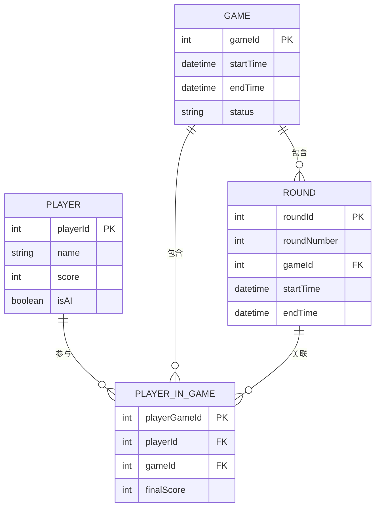
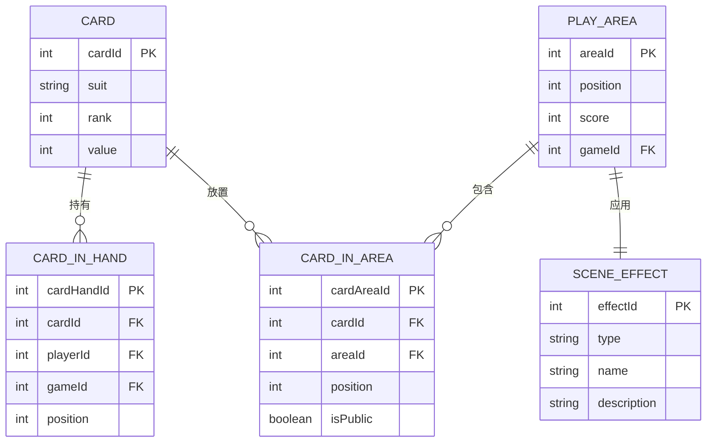
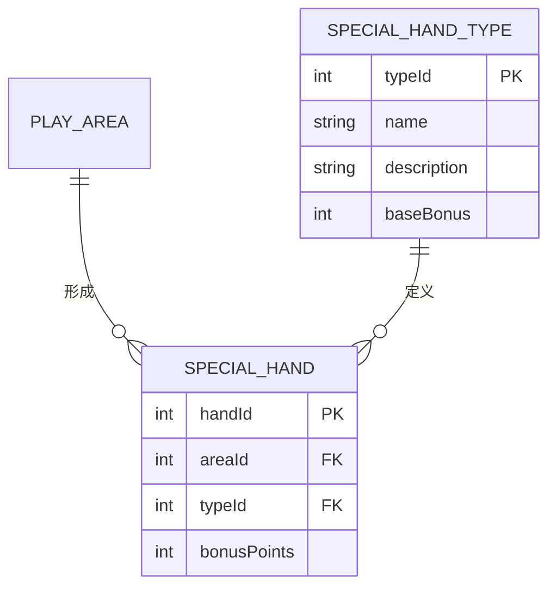

# FoolCards 实体关系图

## 游戏核心实体关系

## 卡牌与场地关系

## 特殊牌型关系

## 实体关系说明

### 主要实体

1. **Player**: 玩家实体，表示游戏中的玩家
   - 包含玩家ID、名称、分数和是否为AI等属性

2. **Game**: 游戏实体，表示一局游戏
   - 包含游戏ID、开始时间、结束时间和状态等属性

3. **Round**: 回合实体，表示游戏中的一个回合
   - 包含回合ID、回合编号、游戏ID、开始时间和结束时间等属性

4. **Card**: 卡牌实体，表示游戏中的一张卡牌
   - 包含卡牌ID、花色、点数和价值等属性

5. **PlayArea**: 场地实体，表示游戏中的一个场地
   - 包含场地ID、位置、分数和游戏ID等属性

6. **SceneEffect**: 场景效果实体，表示场地的特殊效果
   - 包含效果ID、类型、名称和描述等属性

7. **SpecialHand**: 特殊牌型实体，表示场地中形成的特殊牌型
   - 包含牌型ID、场地ID、类型ID和额外分数等属性

8. **SpecialHandType**: 特殊牌型类型实体，表示特殊牌型的类型
   - 包含类型ID、名称、描述和基础加分等属性

### 关系

1. **PlayerInGame**: 玩家与游戏的多对多关系
   - 一个游戏可以有多个玩家，一个玩家可以参与多个游戏

2. **CardInHand**: 卡牌与玩家的多对多关系
   - 一个玩家可以有多张卡牌，一张卡牌可以属于多个玩家（在不同游戏中）

3. **CardInArea**: 卡牌与场地的多对多关系
   - 一个场地可以有多张卡牌，一张卡牌可以放置在多个场地（在不同游戏中）

4. **SceneEffect与PlayArea**: 一对一关系
   - 一个场地有一个场景效果，一个场景效果属于一个场地

5. **SpecialHand与PlayArea**: 多对一关系
   - 一个场地可以有多个特殊牌型，一个特殊牌型属于一个场地

6. **SpecialHand与SpecialHandType**: 多对一关系
   - 一个特殊牌型类型可以有多个特殊牌型实例，一个特殊牌型实例属于一个类型
