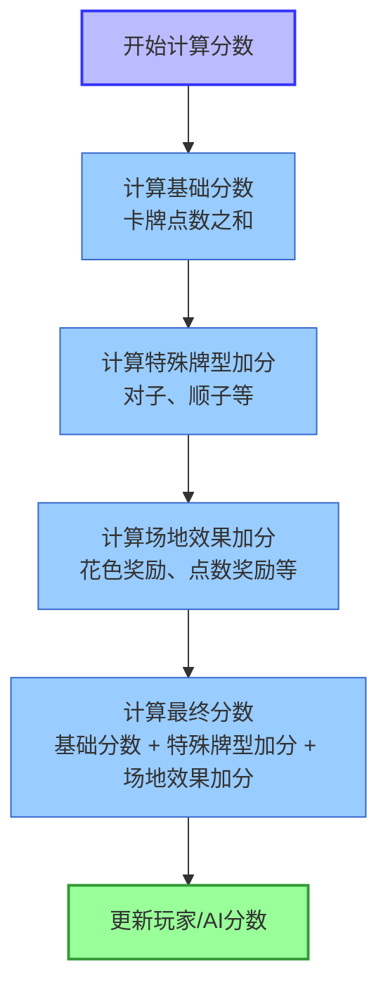
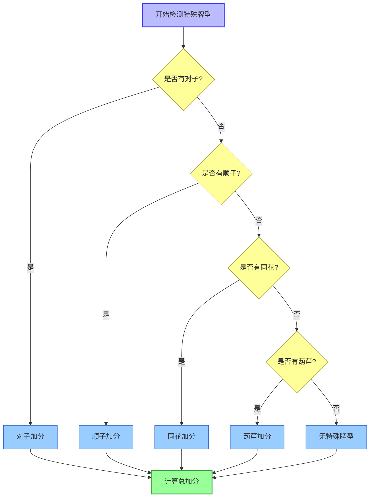

# FoolCards 游戏流程图

## 主要游戏流程

```mermaid
flowchart TD
    Start([启动游戏]) --> LoadResources[加载资源]
    LoadResources --> ShowMainMenu[显示主菜单]
    ShowMainMenu --> StartNewGame[开始新游戏]
    StartNewGame --> GameLoop[游戏循环]
    GameLoop --> GameOver[游戏结束]
    GameOver --> ShowResults[显示结果]
    ShowResults --> ReturnToMenu[返回主菜单]
    ReturnToMenu --> ShowMainMenu

    %% 样式定义
    classDef start fill:#9f9,stroke:#393,stroke-width:2px;
    classDef process fill:#9cf,stroke:#36c,stroke-width:1px;
    classDef menu fill:#ff9,stroke:#993,stroke-width:1px;
    classDef end fill:#f99,stroke:#933,stroke-width:2px;

    %% 应用样式
    class Start start;
    class LoadResources,GameLoop,StartNewGame process;
    class ShowMainMenu,ReturnToMenu menu;
    class GameOver,ShowResults end;
```

## 游戏循环详细流程

```mermaid
flowchart TD
    StartRound[开始新回合] --> DealCards[发放卡牌]
    DealCards --> PlayerTurn[玩家回合]
    PlayerTurn --> AITurn[AI对手回合]
    AITurn --> EndRound[结束回合]
    EndRound --> CalculateScore[计算分数]
    CalculateScore --> CheckGameEnd{检查游戏结束}
    CheckGameEnd -->|是| GameOver[游戏结束\n(达到5回合)]
    CheckGameEnd -->|否| StartRound
    GameOver --> ShowResults[显示结果]

    %% 样式定义
    classDef round fill:#bbf,stroke:#33f,stroke-width:2px;
    classDef action fill:#9cf,stroke:#36c,stroke-width:1px;
    classDef decision fill:#ff9,stroke:#993,stroke-width:1px;
    classDef end fill:#f99,stroke:#933,stroke-width:2px;

    %% 应用样式
    class StartRound,EndRound round;
    class DealCards,PlayerTurn,AITurn,CalculateScore action;
    class CheckGameEnd decision;
    class GameOver,ShowResults end;
```

## 玩家回合详细流程

```mermaid
flowchart TD
    StartPlayerTurn[开始玩家回合] --> SelectCard[选择卡牌]
    SelectCard --> SelectArea[选择场地]
    SelectArea --> ConfirmChoice{确认选择?}
    ConfirmChoice -->|否| SelectCard
    ConfirmChoice -->|是| PlayCard[打出卡牌]
    PlayCard --> CheckSpecialHand[检查特殊牌型]
    CheckSpecialHand --> ApplyAreaEffect[应用场地效果]
    ApplyAreaEffect --> CalculateTempScore[计算临时分数]
    CalculateTempScore --> ContinueOrEnd{继续回合?}
    ContinueOrEnd -->|继续| ExchangeCards[交换卡牌]
    ContinueOrEnd -->|结束| EndPlayerTurn[结束玩家回合]
    ExchangeCards --> EndPlayerTurn

    %% 样式定义
    classDef start fill:#bbf,stroke:#33f,stroke-width:2px;
    classDef action fill:#9cf,stroke:#36c,stroke-width:1px;
    classDef decision fill:#ff9,stroke:#993,stroke-width:1px;
    classDef end fill:#f99,stroke:#933,stroke-width:2px;

    %% 应用样式
    class StartPlayerTurn start;
    class SelectCard,SelectArea,PlayCard,CheckSpecialHand,ApplyAreaEffect,CalculateTempScore,ExchangeCards action;
    class ConfirmChoice,ContinueOrEnd decision;
    class EndPlayerTurn end;
```

## AI对手回合流程

```mermaid
flowchart TD
    StartAITurn[开始AI回合] --> AISelectCards[AI选择卡牌]
    AISelectCards --> AISelectAreas[AI选择场地]
    AISelectAreas --> AIPlayCards[AI打出卡牌]
    AIPlayCards --> DisplayAICards[显示AI打出的卡牌]
    DisplayAICards --> CheckAISpecialHand[检查AI特殊牌型]
    CheckAISpecialHand --> ApplyAIAreaEffect[应用AI场地效果]
    ApplyAIAreaEffect --> CalculateAITempScore[计算AI临时分数]
    CalculateAITempScore --> EndAITurn[结束AI回合]

    %% 样式定义
    classDef start fill:#bbf,stroke:#33f,stroke-width:2px;
    classDef action fill:#9cf,stroke:#36c,stroke-width:1px;
    classDef display fill:#ff9,stroke:#993,stroke-width:1px;
    classDef end fill:#f99,stroke:#933,stroke-width:2px;

    %% 应用样式
    class StartAITurn start;
    class AISelectCards,AISelectAreas,AIPlayCards,CheckAISpecialHand,ApplyAIAreaEffect,CalculateAITempScore action;
    class DisplayAICards display;
    class EndAITurn end;
```

## 游戏结束条件

```mermaid
flowchart TD
    CheckRounds{回合数 >= 5?} -->|是| GameOver[游戏结束]
    CheckRounds -->|否| ContinueGame[继续游戏]

    %% 样式定义
    classDef decision fill:#ff9,stroke:#993,stroke-width:1px;
    classDef end fill:#f99,stroke:#933,stroke-width:2px;
    classDef continue fill:#9cf,stroke:#36c,stroke-width:1px;

    %% 应用样式
    class CheckRounds decision;
    class GameOver end;
    class ContinueGame continue;
```

## 分数计算流程



## 特殊牌型检测流程


