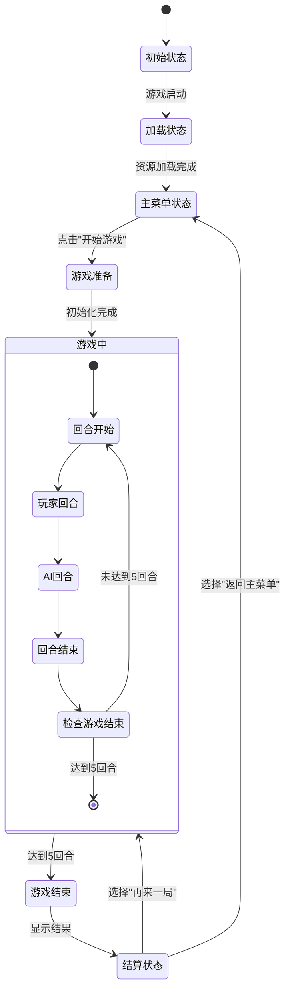
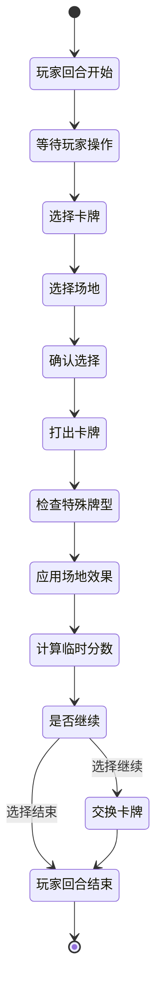
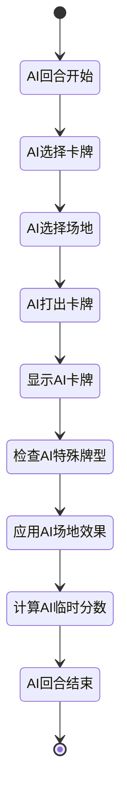
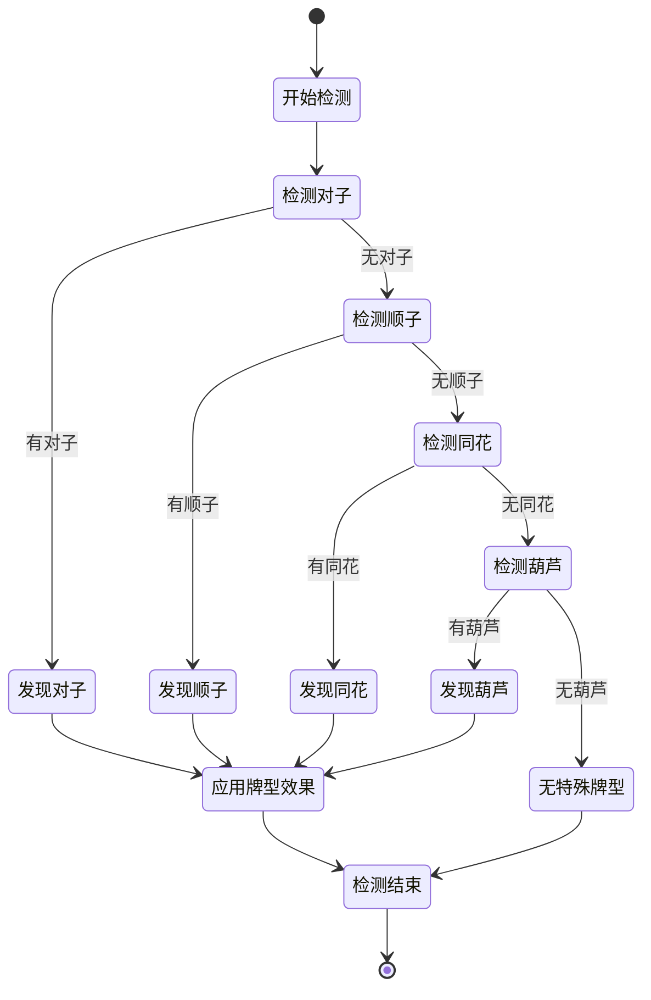
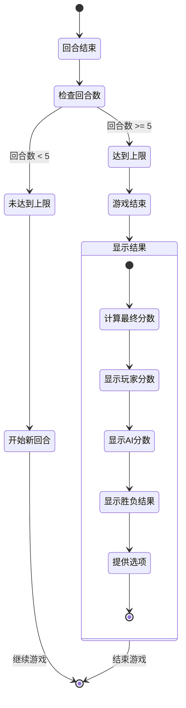
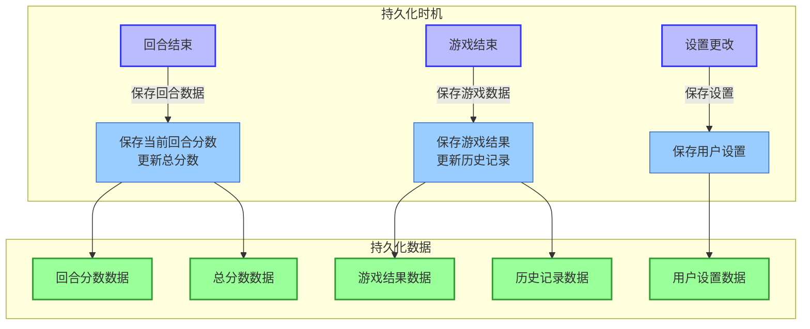

# FoolCards 游戏状态图

## 主要游戏状态



## 玩家回合状态详细流转



## AI回合状态详细流转



## 特殊牌型检测状态



## 游戏结束条件检测



## 状态转换触发条件

```mermaid
flowchart TD
    subgraph 主游戏状态转换
        Initial["初始状态"] -->|游戏启动| Loading["加载状态"]
        Loading -->|资源加载完成| MainMenu["主菜单状态"]
        MainMenu -->|点击"开始游戏"| GamePrep["游戏准备"]
        GamePrep -->|初始化完成| GamePlaying["游戏中"]
        GamePlaying -->|达到5回合| GameOver["游戏结束"]
        GameOver -->|显示结果| Settlement["结算状态"]
        Settlement -->|选择"再来一局"| GamePrep
        Settlement -->|选择"返回主菜单"| MainMenu
    end

    subgraph 回合内状态转换
        RoundStart["回合开始"] -->|发牌完成| PlayerTurn["玩家回合"]
        PlayerTurn -->|玩家操作完成| AITurn["AI回合"]
        AITurn -->|AI操作完成| RoundEnd["回合结束"]
        RoundEnd -->|检查回合数| CheckRound["检查游戏结束"]
        CheckRound -->|未达到5回合| RoundStart
        CheckRound -->|达到5回合| EndGame["游戏结束"]
    end

    %% 样式定义
    classDef mainState fill:#bbf,stroke:#33f,stroke-width:2px;
    classDef roundState fill:#9cf,stroke:#36c,stroke-width:1px;
    classDef endState fill:#f99,stroke:#933,stroke-width:2px;

    %% 应用样式
    class Initial,Loading,MainMenu,GamePrep,GamePlaying,GameOver,Settlement mainState;
    class RoundStart,PlayerTurn,AITurn,RoundEnd,CheckRound roundState;
    class EndGame endState;
```

## 状态持久化


