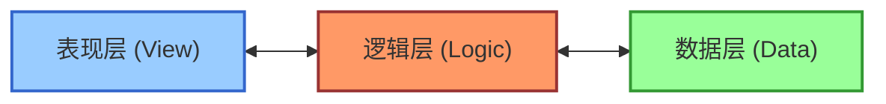
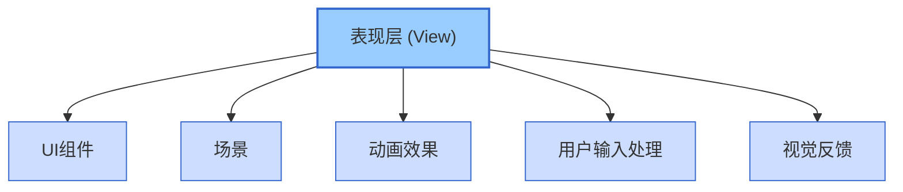
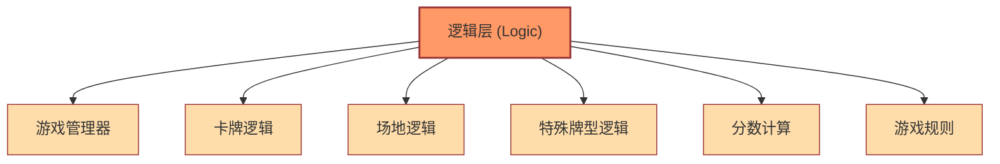
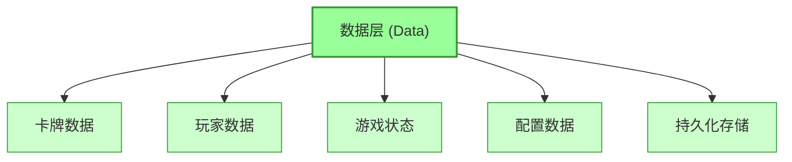
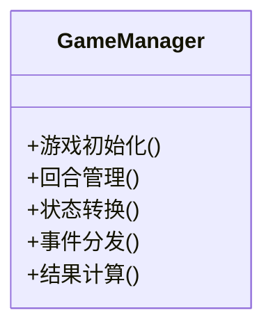
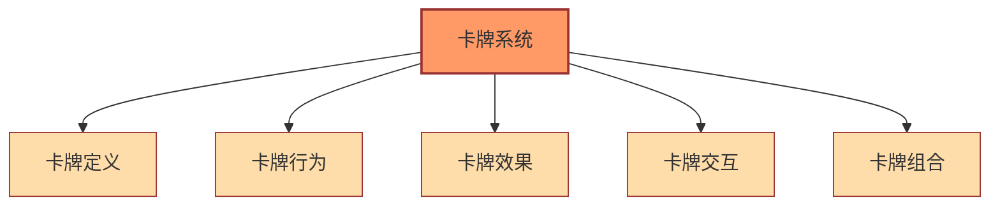
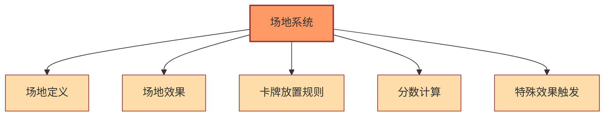
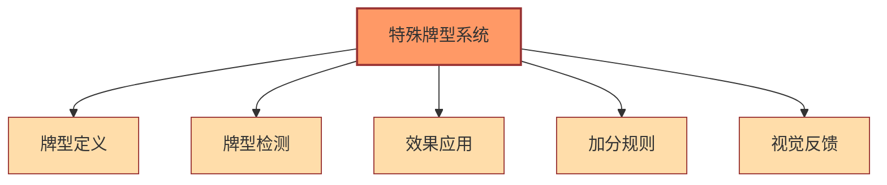
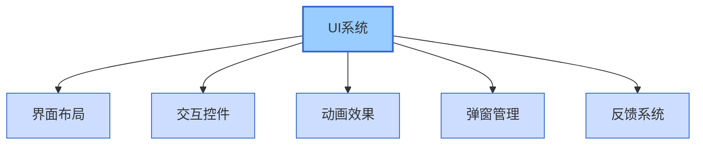

# FoolCards 架构设计

## 整体架构

## 分层详细结构

### 表现层 (View)

### 逻辑层 (Logic)

### 数据层 (Data)

## 核心模块

### 游戏管理模块

### 卡牌系统

### 场地系统

### 特殊牌型系统

### UI系统

## 数据流向

```mermaid
flowchart LR
    UserInput["用户输入"] --> UISystem["UI系统"]
    UISystem --> GameManager["游戏管理模块"]
    GameManager --> LogicProcessing["逻辑处理"]
    LogicProcessing --> DataUpdate["数据更新"]
    DataUpdate --> UIUpdate["UI更新"]
    UIUpdate --> VisualFeedback["视觉反馈"]

    %% 样式定义
    classDef input fill:#bbf,stroke:#33f,stroke-width:2px;
    classDef process fill:#f96,stroke:#933,stroke-width:1px;
    classDef output fill:#9cf,stroke:#36c,stroke-width:1px;
    classDef data fill:#9f9,stroke:#393,stroke-width:1px;

    %% 应用样式
    class UserInput input;
    class UISystem,GameManager,LogicProcessing process;
    class DataUpdate data;
    class UIUpdate,VisualFeedback output;
```

## 扩展性设计

1. **新卡牌类型**：
   - 通过扩展Card基类
   - 定义新的卡牌效果和行为

2. **新场地效果**：
   - 通过扩展SceneEffect类
   - 实现新的效果逻辑

3. **新特殊牌型**：
   - 在SpecialHands中添加新的检测方法
   - 定义新的加分规则

4. **新游戏模式**：
   - 通过扩展GameManager
   - 修改游戏规则和流程

## 技术栈

1. **引擎**：Cocos Creator 3.x
2. **语言**：TypeScript
3. **UI框架**：Cocos UI系统
4. **动画系统**：Cocos Animation
5. **资源管理**：Cocos Asset Bundle

## 性能考虑

1. **对象池**：
   - 卡牌对象重用
   - UI元素复用

2. **事件优化**：
   - 减少不必要的事件触发
   - 使用事件委托模式

3. **渲染优化**：
   - 合理使用图集
   - 控制同屏元素数量

4. **内存管理**：
   - 及时释放不需要的资源
   - 避免循环引用
