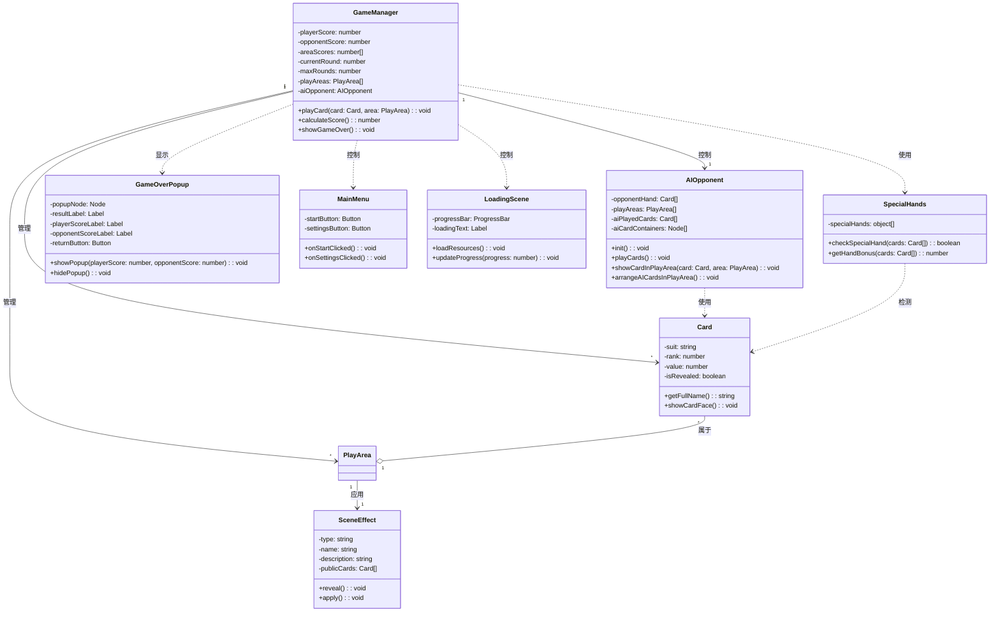
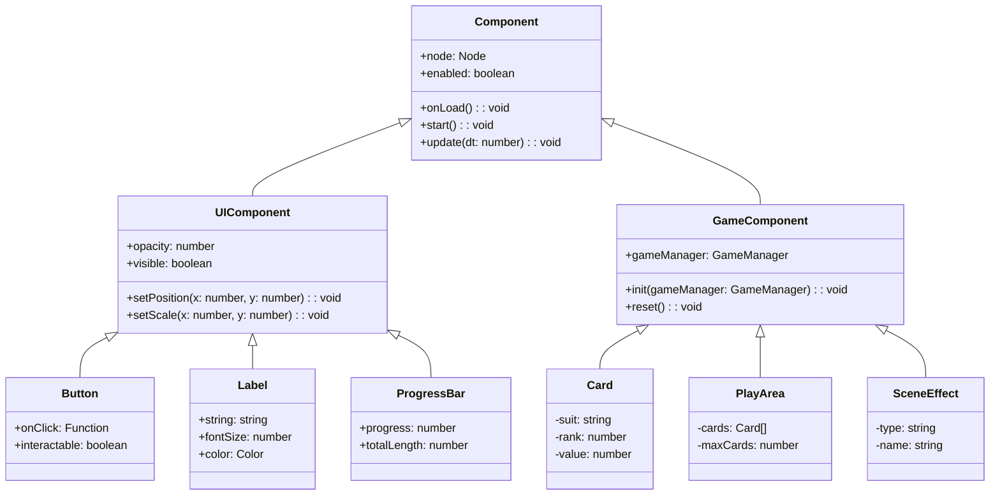

# FoolCards 类图

## 核心类关系

## 组件继承关系

## 类关系说明

### 主要类

1. **GameManager**: 游戏的核心管理类，负责游戏逻辑和状态管理
   - 管理玩家分数、回合数和游戏区域
   - 控制游戏流程（开始新回合、结束回合等）
   - 处理卡牌的打出和分数计算

2. **Card**: 卡牌类，表示游戏中的一张卡牌
   - 包含花色、点数、价值等属性
   - 提供获取卡牌名称、价值和翻转卡牌等方法
   - 继承自GameComponent基类

3. **SceneEffect**: 场景效果类，定义不同场景的特殊效果
   - 包含效果类型、名称和描述
   - 提供应用效果和计算分数的方法
   - 继承自GameComponent基类

4. **SpecialHands**: 特殊牌型管理类，检测和处理特殊牌型
   - 检查卡牌组合是否形成特殊牌型
   - 计算特殊牌型的额外分数

5. **GameOverPopup**: 游戏结束弹窗类，显示游戏结果
   - 显示玩家和对手的最终分数
   - 提供返回主菜单的选项
   - 使用UIComponent子类（Button、Label等）

6. **MainMenu**: 主菜单类，处理主菜单界面的交互
   - 处理开始游戏和设置按钮的点击事件
   - 使用UIComponent子类（Button等）

7. **LoadingScene**: 加载场景类，处理资源加载和进度显示
   - 加载游戏所需的资源
   - 更新加载进度条
   - 使用UIComponent子类（ProgressBar、Label等）
