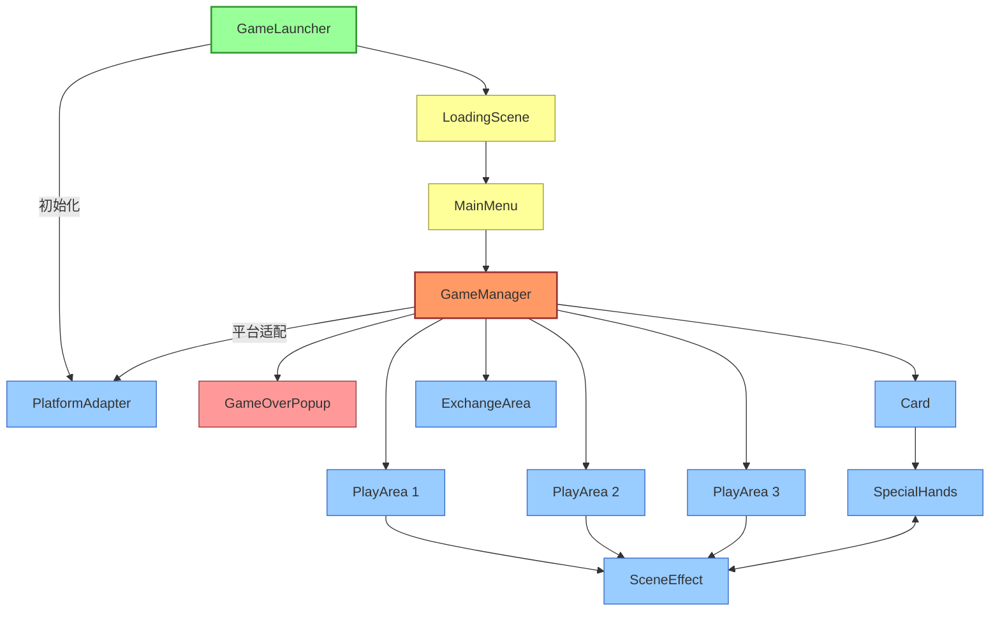
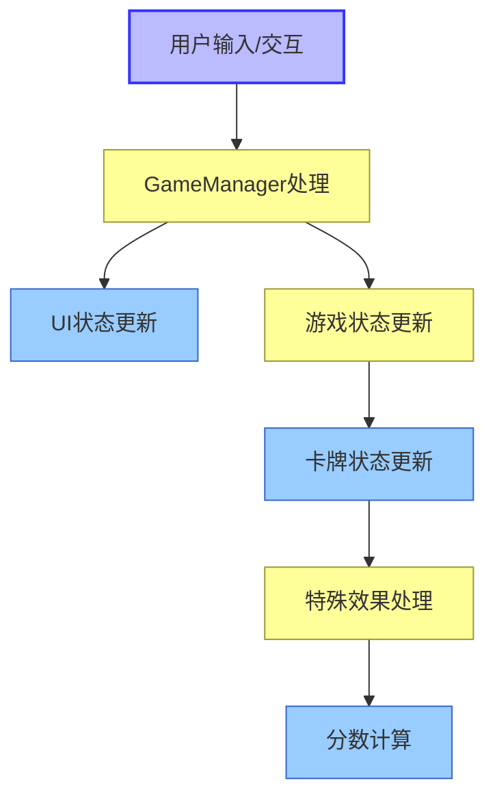
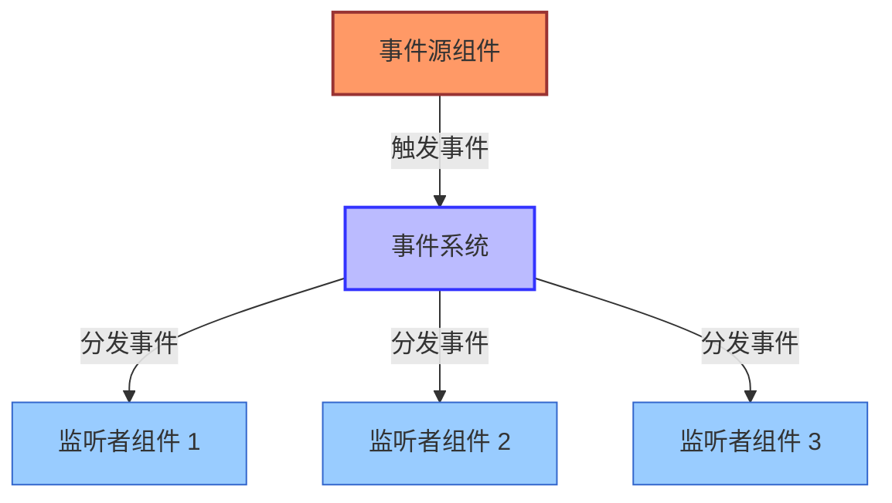

# FoolCards 组件交互图

## 核心组件交互

## 数据流向

## 事件传递机制

## 主要事件类型

1. **游戏流程事件**：
   - 游戏开始
   - 回合开始/结束
   - 游戏结束

2. **卡牌事件**：
   - 卡牌选择
   - 卡牌打出
   - 卡牌效果触发

3. **场地事件**：
   - 场地选择
   - 场地效果触发
   - 场地分数更新

4. **特殊牌型事件**：
   - 特殊牌型检测
   - 特殊牌型效果触发

5. **UI事件**：
   - 按钮点击
   - 拖拽操作
   - 弹窗显示/隐藏

## 组件职责

1. **GameLauncher**：
   - 游戏初始化
   - 资源预加载
   - 场景切换管理

2. **GameManager**：
   - 游戏核心逻辑
   - 回合管理
   - 分数计算
   - 游戏状态控制
   - AI对手管理

3. **AIOpponent**：
   - AI出牌逻辑
   - 对手卡牌管理
   - AI卡牌显示
   - 卡牌排列管理

4. **Card**：
   - 卡牌数据
   - 卡牌视觉表现
   - 卡牌交互逻辑

5. **PlayArea**：
   - 场地状态管理
   - 卡牌放置逻辑
   - 场地效果触发

6. **SceneEffect**：
   - 场地特殊效果定义
   - 效果应用逻辑
   - 视觉效果展示

7. **SpecialHands**：
   - 特殊牌型检测
   - 特殊牌型效果应用
   - 特殊牌型视觉反馈

8. **GameOverPopup**：
   - 游戏结果展示
   - 结算界面交互
   - 重新开始/返回选项
