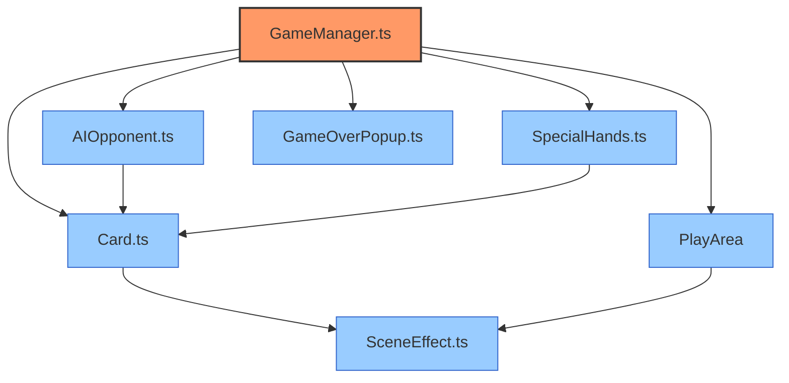

# FoolCards 项目结构图

## 文件目录结构

```mermaid
flowchart TD
    Root["FoolCards/"] --> Assets["assets/"]
    Root --> Docs["docs/"]
    Root --> GitIgnore[".gitignore"]
    Root --> License["LICENSE"]
    Root --> Readme["README.md"]
    Root --> ProjectJson["project.json"]

    %% Assets 子目录
    Assets --> AssetDocs["docs/"]
    Assets --> Prefabs["prefabs/"]
    Assets --> Resources["resources/"]
    Assets --> Scenes["scenes/"]
    Assets --> Scripts["scripts/"]

    %% Prefabs 子目录
    Prefabs --> CardPrefab["Card.prefab"]
    Prefabs --> GameOverPopupPrefab["GameOverPopup.prefab"]
    Prefabs --> SceneEffectPrefab["SceneEffect.prefab"]

    %% Resources 子目录
    Resources --> Background["background/"]
    Resources --> Cards["cards/"]
    Resources --> Menu["menu/"]
    Resources --> UiAssets["ui-assets/"]

    %% UI Assets 子目录
    UiAssets --> Buttons["Buttons/"]
    UiAssets --> Cursors["Cursors/"]
    UiAssets --> GenUI["Gen UI/"]
    UiAssets --> SymbolsText["Symbols & Text/"]

    %% Scenes 子目录
    Scenes --> GameScene["Game.scene"]
    Scenes --> LoadingScene["Loading.scene"]
    Scenes --> MainMenuScene["MainMenu.scene"]

    %% Scripts 子目录
    Scripts --> AIOpponent["AIOpponent.ts"]
    Scripts --> Card["Card.ts"]
    Scripts --> GameLauncher["GameLauncher.ts"]
    Scripts --> GameManager["GameManager.ts"]
    Scripts --> GameOverPopup["GameOverPopup.ts"]
    Scripts --> LoadingSceneScript["LoadingScene.ts"]
    Scripts --> MainMenu["MainMenu.ts"]
    Scripts --> PlatformAdapter["PlatformAdapter.ts"]
    Scripts --> SceneEffect["SceneEffect.ts"]
    Scripts --> SpecialHands["SpecialHands.ts"]
    Scripts --> SpecialHandsPopup["SpecialHandsPopup.ts"]

    %% Docs 子目录
    Docs --> DiagramsDir["diagrams/"]

    %% Diagrams 子目录
    DiagramsDir --> StructureDir["structure/"]
    DiagramsDir --> ERDir["er/"]
    DiagramsDir --> FlowchartsDir["flowcharts/"]
    DiagramsDir --> UIDir["ui/"]

    %% 样式设置
    classDef rootNode fill:#f9f,stroke:#333,stroke-width:2px;
    classDef mainDir fill:#bbf,stroke:#33f,stroke-width:1px;
    classDef subDir fill:#ddf,stroke:#33f,stroke-width:1px;
    classDef file fill:#fff,stroke:#999,stroke-width:1px;

    class Root rootNode;
    class Assets,Docs mainDir;
    class AssetDocs,Prefabs,Resources,Scenes,Scripts,DiagramsDir,StructureDir,ERDir,FlowchartsDir,UIDir,UiAssets subDir;
    class CardPrefab,GameOverPopupPrefab,SceneEffectPrefab,GameScene,LoadingScene,MainMenuScene,AIOpponent,Card,GameLauncher,GameManager,GameOverPopup,LoadingSceneScript,MainMenu,PlatformAdapter,SceneEffect,SpecialHands,SpecialHandsPopup,GitIgnore,License,Readme,ProjectJson,Background,Cards,Menu,Buttons,Cursors,GenUI,SymbolsText file;
```



## 核心组件关系图



## 游戏流程图

```mermaid
flowchart LR
    GameLauncher["GameLauncher.ts"] --> LoadingScene["LoadingScene.ts"]
    LoadingScene --> MainMenu["MainMenu.ts"]
    MainMenu --> GameManager["GameManager.ts"]
    GameManager --> GameOverPopup["GameOverPopup.ts"]
    GameOverPopup --> |重新开始| GameManager
    GameOverPopup --> |返回主菜单| MainMenu

    classDef start fill:#9f9,stroke:#333,stroke-width:2px;
    classDef scene fill:#ff9,stroke:#993,stroke-width:1px;
    classDef end fill:#f99,stroke:#933,stroke-width:1px;

    class GameLauncher start;
    class LoadingScene,MainMenu,GameManager scene;
    class GameOverPopup end;
```

## 项目结构说明

### 主要目录

1. **assets/**: 包含所有游戏资源
   - **docs/**: 项目文档
   - **prefabs/**: 游戏中使用的预制体
   - **resources/**: 游戏资源（图片、音频等）
   - **scenes/**: 游戏场景
   - **scripts/**: 游戏脚本

2. **docs/**: 项目文档和图表
   - **diagrams/**: 项目相关图表
     - **structure/**: 项目结构图
     - **er/**: 实体关系图
     - **flowcharts/**: 流程图
     - **ui/**: UI设计图

### 主要脚本文件

| 文件名 | 描述 | 主要功能 |
|--------|------|----------|
| **GameManager.ts** | 游戏管理器 | 游戏核心逻辑、回合管理、分数计算 |
| **Card.ts** | 卡牌类 | 定义卡牌属性和行为、卡牌视觉表现 |
| **AIOpponent.ts** | AI对手组件 | AI出牌逻辑、对手卡牌管理、AI卡牌显示 |
| **SceneEffect.ts** | 场景效果 | 定义不同场景的特殊效果、效果应用逻辑 |
| **SpecialHands.ts** | 特殊牌型 | 特殊牌型检测、特殊牌型效果应用 |
| **GameOverPopup.ts** | 游戏结束弹窗 | 显示游戏结果、提供重新开始选项 |
| **MainMenu.ts** | 主菜单脚本 | 处理主菜单界面交互、游戏启动 |
| **LoadingScene.ts** | 加载场景脚本 | 资源加载、进度显示 |
| **GameLauncher.ts** | 游戏启动器 | 游戏初始化、资源预加载 |
| **PlatformAdapter.ts** | 平台适配器 | 处理不同平台的兼容性问题 |

### 场景文件

| 场景文件 | 描述 | 主要功能 |
|----------|------|----------|
| **Game.scene** | 游戏主场景 | 包含游戏主界面、卡牌区域、场地区域 |
| **MainMenu.scene** | 主菜单场景 | 包含开始游戏、设置等选项 |
| **Loading.scene** | 加载场景 | 显示资源加载进度 |

### 预制体

| 预制体 | 描述 | 主要组件 |
|--------|------|----------|
| **Card.prefab** | 卡牌预制体 | 包含卡牌视觉元素、交互组件 |
| **GameOverPopup.prefab** | 游戏结束弹窗预制体 | 包含结果显示、按钮组件 |
| **SceneEffect.prefab** | 场景效果预制体 | 包含效果视觉元素、动画组件 |
